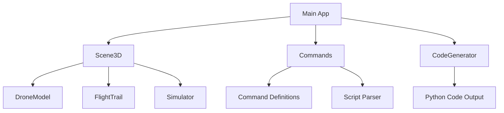

# Development Notes

## Current Version: 1.1.4

### Latest Changes (v1.1.4)
- ✅ **Camera Lock During Typing**: Camera controls are now disabled when editing code
- ✅ **Bright Green Typing Indicator**: Visual feedback shows when in typing mode
- ✅ **Escape Key Support**: Press Escape to exit typing mode
- ✅ **Updated Python Scripts**: All example scripts compatible with v1.1.4 API
- ✅ **Obstacle Import and Collision Detection**: Base map with 8 predefined obstacles (4 walls, 1 tower, 1 hoop, 2 cones)
- ✅ **3D Visualization**: Real-scale drone (100mm x 100mm x 30mm) with detailed model

### Architecture Overview



### File Structure
```
drone-planner/
├── index.html              # Main HTML entry point
├── main.js                # Application logic & UI
├── style.css              # Styling & theming
├── package.json            # Project configuration
├── vite.config.js          # Vite build config
├── update.sh              # Update script
├── electron/              # Electron main process
│   └── main.js
├── src/
│   ├── scene/
│   │   ├── Scene3D.js      # 3D scene management
│   │   ├── DroneModel.js   # Drone 3D model
│   │   ├── FlightTrail.js  # Flight path trails
│   │   └── Simulator.js    # Flight simulation
│   ├── commands/
│   │   ├── Commands.js     # Command definitions
│   │   └── ScriptParser.js # Script parsing
│   └── codegen/
│       └── CodeGenerator.js # Python code generation
├── showcase.py            # Full demo script
├── obama.py               # Obama portrait script
└── swarm_showcase.py      # 20-drone swarm script
```

### Key Features

#### 1. Camera Lock During Typing
- **Problem**: Camera movement interfered with code editing
- **Solution**: Camera controls disabled when code textarea is focused
- **Visual Feedback**: Bright green border + pulsing indicator
- **Exit**: Click outside textarea or press Escape

#### 2. Code Generation
- Single drone: Direct method calls
- Multiple drones: Threaded execution
- All educational drone API methods supported

#### 3. Simulation
- Real-time 3D visualization
- Accurate physics simulation
- Multi-drone support

### Dependencies

#### Frontend
- Three.js - 3D rendering
- OrbitControls - Camera controls

#### Backend
- Electron - Desktop app framework
- Vite - Build tool

#### Hardware
- Educational drone Python library

### Build Commands

```bash
# Install dependencies
npm install

# Development mode
npm run dev

# Production build
npm run build

# Start Electron app
npm start
```

### Testing Checklist

- [x] Camera lock during typing
- [x] Green typing indicator
- [x] Escape key to exit typing
- [x] Python script compatibility
- [x] Code generation accuracy
- [x] Simulation smoothness
- [x] Obstacle loading and display
- [x] Collision detection
- [x] Base map with 8 obstacles

### Future Improvements

- [ ] 3D model improvements
- [ ] Export flight plans to JSON
- [ ] Import flight plans from JSON
- [ ] Keyboard shortcuts for common commands
- [ ] Undo/Redo functionality
- [ ] Custom obstacle placement
- [ ] Obstacle export/import from files

### Troubleshooting

#### Camera not moving
- Check if code textarea is focused
- Look for green typing indicator
- Press Escape to exit typing mode

#### Code not generating
- Check command definitions in Commands.js
- Verify command parameters
- Check console for errors

#### Simulation not playing
- Verify drone commands exist
- Check swarmResults in Scene3D
- Ensure isPlaying flag is set

## Tags

#project #development #architecture #code
